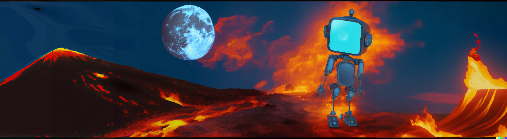

# ArtiFact: A Large-Scale Dataset with Artificial and Factual Images for Generalizable and Robust Synthetic Image Detection



**Paper:** https://arxiv.org/abs/2302.11970

**Abstract:** Synthetic image generation has opened up new  opportunities but has also created threats in regard to privacy, authenticity, and security. Detecting fake images is of paramount importance to prevent illegal activities, and previous research has shown that generative models leave unique patterns in their synthetic images that can be exploited to detect them. However, the fundamental problem of generalization remains, as even state-of-the-art detectors encounter difficulty when facing generators never seen during training. To assess the generalizability and robustness of synthetic image detectors in the face of real-world impairments, this paper presents a large-scale dataset named ArtiFact, comprising diverse generators, object categories, and real-world challenges. Moreover, the proposed multi-class classification scheme, combined with a filter stride reduction strategy addresses social platform impairments and effectively detects synthetic images from both seen and unseen generators. The proposed solution significantly outperforms other top teams by 8.34% on Test 1, 1.26% on Test 2, and 15.08% on Test 3 in the IEEE VIP Cup challenge at ICIP 2022, as measured by the accuracy metric.

# Result on IEEE VIP Cup at ICIP 2022

Accuracy (%) of Top3 Teams on Leaderboard,
| Team Names            | Test 1     | Test 2     | Test 3     |
| :-------------------- | :--------: | :--------: | :--------: |
| Sherlock              | 87\.70     | 77\.52     | 73\.45     |
| FAU Erlangen-Nürnberg | 87\.14     | 81\.74     | 75\.52     |
| **Megatron (Ours)**   | **96\.04** | **83\.00** | **90\.60** |

> **Note:** A small portion of the proposed ArtiFact dataset, totaling 222K images of 71K real images and 151K fake images from only 13 generators is used in the IEEE VIP Cup. Here all the Test data is kept confidential from all participating teams. Additionally, the generators used for the Test 1 data are known to all teams, whereas the generators for Test 2 and Test 3 are kept undisclosed.

# Dataset Description
* Total number of images: 2,496,738
* Number of real images: 964,989
* Number of fake images: 1,531,749
* Number of generators used for fake images: 25 (including 13 GANs, 7 Diffusion, and 5 miscellaneous generators)
* Number of sources used for real images: 8
* Categories included in the dataset: Human/Human Faces, Animal/Animal Faces, Places, Vehicles, Art, and other real-life objects
* Number of real images per category: Varies depending on the source dataset used
* Number of fake images per category: Varies depending on the generator used
* Image Resolution: 200 x 200

# Download Dataset

The dataset is hosted on Kaggle. The dataset can be downloaded directly from the browser using link below or can be downloaded using [kaggle-api](https://github.com/Kaggle/kaggle-api) using following method.

Link: [ArtiFact Dataset](https://www.kaggle.com/datasets/awsaf49/artifact-dataset)

# Data Generation

* Images are randomly sampled from different methods then transformed using impairments. The methods are listed below,
    <details close>
    <summary>Methods</summary>

    |                 |                                                |                                            |                                     |                                               |                                                |                                                    |                                                                   |                                                   |                                                 |                                             |                                             |                                                              |                                                       |                                            |                                           |                                                  |                                                   |                                                                             |                                            |                                                                                           |                                           |                                           |                                                                               |                                               |                                                              |                                                     |                                                     |                                                           |                                                   |                                                        |                                         |                                                                   |                                                                 |
    | :-------------- | :--------------------------------------------- | :----------------------------------------- | :---------------------------------- | :-------------------------------------------- | :--------------------------------------------- | :------------------------------------------------- | :---------------------------------------------------------------- | :------------------------------------------------ | :---------------------------------------------- | :------------------------------------------ | :------------------------------------------ | :----------------------------------------------------------- | :---------------------------------------------------- | :----------------------------------------- | :---------------------------------------- | :----------------------------------------------- | :------------------------------------------------ | :-------------------------------------------------------------------------- | :----------------------------------------- | :---------------------------------------------------------------------------------------- | :---------------------------------------- | :---------------------------------------- | :---------------------------------------------------------------------------- | :-------------------------------------------- | :----------------------------------------------------------- | :-------------------------------------------------- | :-------------------------------------------------- | :-------------------------------------------------------- | :------------------------------------------------ | :----------------------------------------------------- | :-------------------------------------- | :---------------------------------------------------------------- | :-------------------------------------------------------------- |
    | **Method** | ImageNet                                       | COCO                                       | LSUN                                | AFHQ                                          | FFHQ                                           | Metfaces                                           | CelebAHQ                                                          | Landscape                                         | Glide                                           | StyleGAN2                                   | StyleGAN3                                   | Generative Inpainting                                        | Taming Transformer                                    | MAT                                        | LaMa                                      | Stable Diffusion                                 | VQ Diffusion                                      | Palette                                                                     | StyleGAN1                                  | Latent Diffusion                                                                          | CIPS                                      | StarGAN                                   | BigGAN                                                                        | GANformer                                     | ProjectedGAN                                                 | SFHQ                                                | FaceSynthetics                                      | Denoising Diffusion GAN                                   | DDPM                                              | DiffusionGAN                                           | GauGAN                                  | ProGAN                                                            | CycleGAN                                                        |
    | **Reference** | [link](https://www.image-net.org/download.php) | [link](https://cocodataset.org/\#download) | [link](https://github.com/fyu/lsun) | [link](https://github.com/clovaai/stargan-v2) | [link](https://github.com/NVlabs/ffhq-dataset) | [link](https://github.com/NVlabs/metfaces-dataset) |  [link](https://github.com/tkarras/progressive*growing*of*gans) | [link](https://github.com/mahmoudnafifi/HistoGAN) | [link](https://github.com/openai/glide-text2im) | [link](https://github.com/NVlabs/stylegan2) | [link](https://github.com/NVlabs/stylegan3) |  [link](https://github.com/JiahuiYu/generative*inpainting) | [link](https://github.com/CompVis/taming-transformer) | [link](https://github.com/fenglinglwb/mat) | [link](https://github.com/saic-mdal/lama) | [link](https://github.com/huggingface/diffusers) | [link](https://github.com/microsoft/VQ-Diffusion) | [link](https://github.com/Janspiry/Palette-Image-to-Image-Diffusion-Models) | [link](https://github.com/NVlabs/stylegan) | [link](https://github.com/compvis/latent-diffusion\#retrieval-augmented-diffusion-models) | [link](https://github.com/saic-mdal/CIPS) | [link](https://github.com/yunjey/StarGAN) | [link](https://github.com/open-mmlab/mmgeneration/tree/master/configs/biggan) | [link](https://github.com/dorarad/gansformer) |  [link](https://github.com/autonomousvision/projected*gan) | [link](https://github.com/SelfishGene/SFHQ-dataset) | [link](https://github.com/microsoft/FaceSynthetics) | [link](https://github.com/NVlabs/denoising-diffusion-gan) | [link](https://github.com/hojonathanho/diffusion) | [link](https://github.com/Zhendong-Wang/Diffusion-GAN) | [link](https://github.com/NVlabs/SPADE) |  [link](https://github.com/tkarras/progressive*growing*of*gans) | [link](https://github.com/junyanz/pytorch-CycleGAN-and-pix2pix) |
    </details>

* All images went through RandomCrop and Random Impairments (Jpeg Compression & Downscale). To apply these transformation use [data/transform.py](data/transform.py) which applies random transformation. All images are cropped and resized to $200 \times 200$ pixels and then compressed using JPEG at a random quality level.

    ```shell
    python data/transform.py <input directory> <output directory> <seed>
    ```

# Citation
```bibtex
@misc{rahman2023artifact,
      title={ArtiFact: A Large-Scale Dataset with Artificial and Factual Images for Generalizable and Robust Synthetic Image Detection}, 
      author={Md Awsafur Rahman and Bishmoy Paul and Najibul Haque Sarker and Zaber Ibn Abdul Hakim and Shaikh Anowarul Fattah},
      year={2023},
      eprint={2302.11970},
      archivePrefix={arXiv},
      primaryClass={cs.CV}
}
```

# License

ArtiFact dataset takes leverage of data from multiple methods thus different parts of the dataset come with different licenses. All the methods and their associated licenses are mentioned in the table,

<details close>
<summary>Data License</summary>

| Method                  | License                                                                                |
|:------------------------|:---------------------------------------------------------------------------------------|
| ImageNet                | Non Commercial                                                                         |
| COCO                    | Creative Commons Attribution 4.0 License                                               |
| LSUN                    | Unknown                                                                                |
| AFHQ                    | Creative Commons Attribution-NonCommercial 4.0 International Public                    |
| FFHQ                    | Creative Commons BY-NC-SA 4.0 license                                                  |
| Metfaces                | Creative Commons BY-NC 2.0                                                             |
| CelebAHQ                | Creative Commons Attribution-NonCommercial 4.0 International Public                    |
| Landscape               | MIT license                                                                            |
| Glide                   | MIT license                                                                            |
| StyleGAN2               | Nvidia Source Code License                                                             |
| StyleGAN3               | Nvidia Source Code License                                                             |
| Generative Inpainting   | Creative Commons Public Licenses                                                       |
| Taming Transformer      | MIT License                                                                            |
| MAT                     | Creative Commons Public Licenses                                                       |
| LaMa                    | Apache-2.0 License                                                                     |
| Stable Diffusion        | Apache-2.0 License                                                                     |
| VQ Diffusion            | MIT License                                                                            |
| Palette                 | MIT License                                                                            |
| StyleGAN1               | Creative Commons Public Licenses                                                       |
| Latent Diffusion        | MIT License                                                                            |
| CIPS                    | MIT License                                                                            |
| StarGAN                 | MIT License                                                                            |
| BigGAN                  | MIT License                                                                            |
| GANformer               | MIT License                                                                            |
| ProjectedGAN            | MIT License                                                                            |
| SFHQ                    | MIT License                                                                            |
| FaceSynthetics          | Research Use of Data Agreement v1.0                                                    |
| Denoising Diffusion GAN | NVIDIA License                                                                         |
| DDPM                    | Unknown                                                                                |
| DiffusionGAN            | MIT License                                                                            |
| GauGAN                  | Creative Commons Attribution-NonCommercial-ShareAlike 4.0 International Public License |
| ProGAN                  | Attribution-NonCommercial 4.0 International                                            |
| CycleGAN                | BSD                                                                                    |

</details>

# Acknowledgment

* The authors would like to express their gratitude to the IEEE Signal Processing Society, GRIP of the University Federico II of Naples (Italy), and NVIDIA (USA) for hosting the [IEEE Video and Image Processing (VIP) Cup](https://grip-unina.github.io/vipcup2022/) competition at ICIP 2022. This competition provided a platform for the authors to showcase their work and motivated them to push their boundaries to deliver a state-of-the-art solution.

* The authors also would like to express their gratitude to the authors of the methods that is used for creating ArtiFact dataset. All the methods and their reference is added below,
    <details close>
    <summary>Data Reference</summary>

    | Method                  | Reference                                                                                |
    |:------------------------|:-----------------------------------------------------------------------------------------|
    | ImageNet                | [link](https://www.image-net.org/download.php)                                           |
    | COCO                    | [link](https://cocodataset.org/#download)                                                |
    | LSUN                    | [link](https://github.com/fyu/lsun)                                                      |
    | AFHQ                    | [link](https://github.com/clovaai/stargan-v2)                                            |
    | FFHQ                    | [link](https://github.com/NVlabs/ffhq-dataset)                                           |
    | Metfaces                | [link](https://github.com/NVlabs/metfaces-dataset)                                       |
    | CelebAHQ                | [link](https://github.com/tkarras/progressive_growing_of_gans)                           |
    | Landscape               | [link](https://github.com/mahmoudnafifi/HistoGAN)                                        |
    | Glide                   | [link](https://github.com/openai/glide-text2im)                                          |
    | StyleGAN2               | [link](https://github.com/NVlabs/stylegan2)                                              |
    | StyleGAN3               | [link](https://github.com/NVlabs/stylegan3)                                              |
    | Generative Inpainting   | [link](https://github.com/JiahuiYu/generative_inpainting)                                |
    | Taming Transformer      | [link](https://github.com/CompVis/taming-transformer)                                    |
    | MAT                     | [link](https://github.com/fenglinglwb/mat)                                               |
    | LaMa                    | [link](https://github.com/saic-mdal/lama)                                                |
    | Stable Diffusion        | [link](https://github.com/huggingface/diffusers)                                         |
    | VQ Diffusion            | [link](https://github.com/microsoft/VQ-Diffusion)                                        |
    | Palette                 | [link](https://github.com/Janspiry/Palette-Image-to-Image-Diffusion-Models)              |
    | StyleGAN1               | [link](https://github.com/NVlabs/stylegan)                                               |
    | Latent Diffusion        | [link](https://github.com/compvis/latent-diffusion#retrieval-augmented-diffusion-models) |
    | CIPS                    | [link](https://github.com/saic-mdal/CIPS)                                                |
    | StarGAN                 | [link](https://github.com/yunjey/StarGAN)                                                |
    | BigGAN                  | [link](https://github.com/open-mmlab/mmgeneration/tree/master/configs/biggan)            |
    | GANformer               | [link](https://github.com/dorarad/gansformer)                                            |
    | ProjectedGAN            | [link](https://github.com/autonomousvision/projected_gan)                                |
    | SFHQ                    | [link](https://github.com/SelfishGene/SFHQ-dataset)                                      |
    | FaceSynthetics          | [link](https://github.com/microsoft/FaceSynthetics)                                      |
    | Denoising Diffusion GAN | [link](https://github.com/NVlabs/denoising-diffusion-gan)                                |
    | DDPM                    | [link](https://github.com/hojonathanho/diffusion)                                        |
    | DiffusionGAN            | [link](https://github.com/Zhendong-Wang/Diffusion-GAN)                                   |
    | GauGAN                  | [link](https://github.com/NVlabs/SPADE)                                                  |
    | ProGAN                  | [link](https://github.com/tkarras/progressive_growing_of_gans)                           |
    | CycleGAN                | [link](https://github.com/junyanz/pytorch-CycleGAN-and-pix2pix)                          |

    </details>
